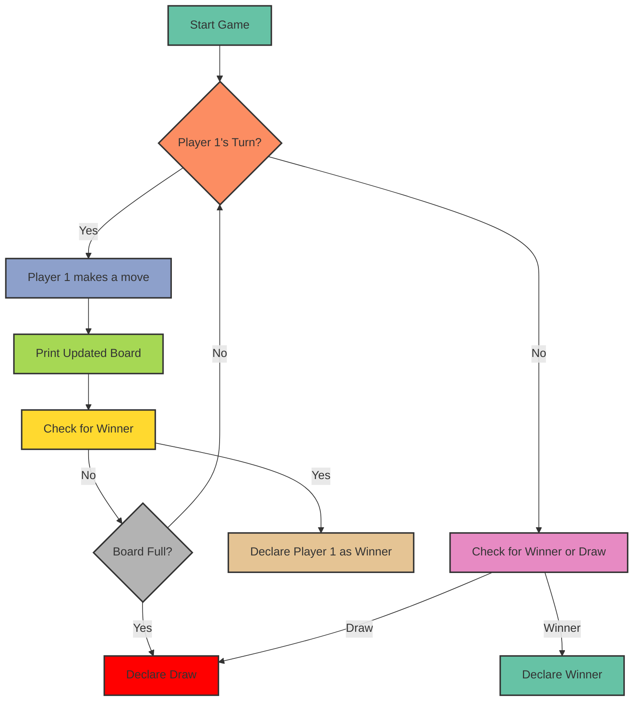

# Tic Tac Toe Game Project Guide

## Overview

This project implements a simple Tic Tac Toe game in Python using object-oriented programming concepts. Players take turns marking spaces on a 3x3 grid with their respective symbols (X or 0) until one player wins or the game ends in a draw.

## How It Works

### Game Flow

1. Two players are initialised with their respective symbols ('X' and '0') and prompted to enter their names.
2. A 3x3 board is displayed where players can make their moves.
3. Players take turns entering positions (1-9) to mark spaces on the board.
4. The game checks for a winner after each move and ends if a player achieves a winning pattern.
5. If no winner is found, the game ends in a draw if all spaces on the board are filled.

### Logic

- The board is represented as a list with 9 elements, initially filled with empty spaces (' ').
- Players' moves are validated to ensure they are within the range and the chosen space is not already occupied.
- Winning patterns are checked after each move to determine if a player has won the game.
- If all spaces are filled and no winner is found, the game ends in a draw.

## Exception Handling

- **ValueError**: Handles invalid input when players enter non-numeric values or positions outside the range (1-9).
- **IndexError**: Ensures that the position entered by the player is within the valid range for accessing the board.
- **OccupiedPositionError**: Custom exception to handle cases where players try to mark already occupied spaces.

## Visual Representation

## Repository Structure

- `tic_tac_toe.py`: Contains the Python code for the Tic Tac Toe game.
- `README.md`: Markdown file providing an overview of the project, instructions, and usage guide.

## Usage

1. Clone the repository to your local machine.
2. Run `python tic_tac_toe.py` in your terminal to start the game.
3. Follow the prompts to enter player names and make moves.
