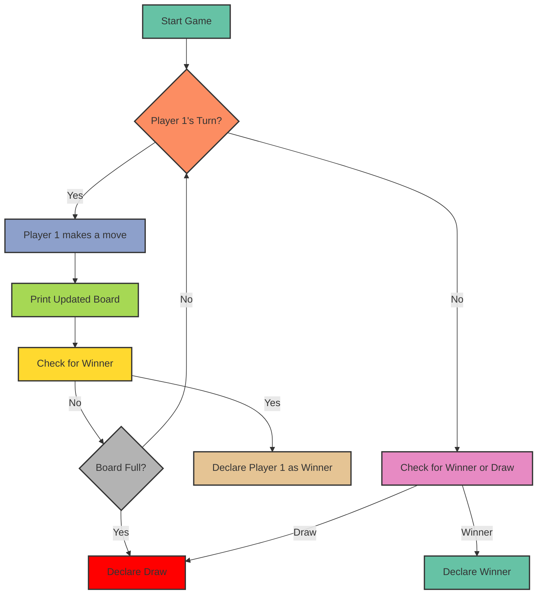

<h1>Tic Tac Toe Game Project Guide</h1>

## Overview

This project implements a simple Tic Tac Toe game in Python using object-oriented programming concepts. Players take turns marking spaces on a 3x3 grid with their respective symbols (X or 0) until one player wins or the game ends in a draw.

## How It Works

### Game Flow

1. Two players are initialised with their respective symbols ('X' and '0') and prompted to enter their names.
2. A 3x3 board is displayed where players can make their moves.
3. Players take turns entering positions (1-9) to mark spaces on the board.
4. The game checks for a winner after each move and ends if a player achieves a winning pattern.
5. If no winner is found, the game ends in a draw if all spaces on the board are filled.

### Logic

- The board is represented as a list with 9 elements, initially filled with empty spaces (' ').
- Players' moves are validated to ensure they are within the range and the chosen space is not already occupied.
- Winning patterns are checked after each move to determine if a player has won the game.
- If all spaces are filled and no winner is found, the game ends in a draw.

## Exception Handling

- **ValueError**: Handles invalid input when players enter non-numeric values or positions outside the range (1-9).
- **IndexError**: Ensures that the position entered by the player is within the valid range for accessing the board.
- **OccupiedPositionError**: Custom exception to handle cases where players try to mark already occupied spaces.

## Visual Representation

## Repository Structure

- `tic_tac_toe.py`: Contains the Python code for the Tic Tac Toe game.
- `README.md`: Markdown file providing an overview of the project, instructions, and usage guide.

## Usage

1. Clone the repository to your local machine.
2. Run `python tic_tac_toe.py` in your terminal to start the game.
3. Follow the prompts to enter player names and make moves.

<h2 align="left">I code with</h2>

<svg xmlns="http://www.w3.org/2000/svg" x="0px" y="0px" width="48" height="48" viewBox="0 0 48 48">
<path fill="#0277BD" d="M24.047,5c-1.555,0.005-2.633,0.142-3.936,0.367c-3.848,0.67-4.549,2.077-4.549,4.67V14h9v2H15.22h-4.35c-2.636,0-4.943,1.242-5.674,4.219c-0.826,3.417-0.863,5.557,0,9.125C5.851,32.005,7.294,34,9.931,34h3.632v-5.104c0-2.966,2.686-5.896,5.764-5.896h7.236c2.523,0,5-1.862,5-4.377v-8.586c0-2.439-1.759-4.263-4.218-4.672C27.406,5.359,25.589,4.994,24.047,5z M19.063,9c0.821,0,1.5,0.677,1.5,1.502c0,0.833-0.679,1.498-1.5,1.498c-0.837,0-1.5-0.664-1.5-1.498C17.563,9.68,18.226,9,19.063,9z"></path><path fill="#FFC107" d="M23.078,43c1.555-0.005,2.633-0.142,3.936-0.367c3.848-0.67,4.549-2.077,4.549-4.67V34h-9v-2h9.343h4.35c2.636,0,4.943-1.242,5.674-4.219c0.826-3.417,0.863-5.557,0-9.125C41.274,15.995,39.831,14,37.194,14h-3.632v5.104c0,2.966-2.686,5.896-5.764,5.896h-7.236c-2.523,0-5,1.862-5,4.377v8.586c0,2.439,1.759,4.263,4.218,4.672C19.719,42.641,21.536,43.006,23.078,43z M28.063,39c-0.821,0-1.5-0.677-1.5-1.502c0-0.833,0.679-1.498,1.5-1.498c0.837,0,1.5,0.664,1.5,1.498C29.563,38.32,28.899,39,28.063,39z"></path>
</svg>
